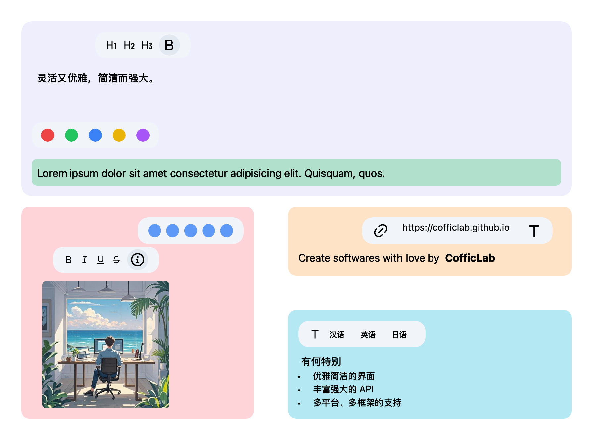

# JuiceEditor



A powerful rich text editor.

Currently still under development and not yet stable.

## Quick Start

1.Install JuiceEditor

```bash
npm install @coffic/juice-editor
```

2.Use JuiceEditor in your project

```js
import { defineJuiceEditor } from '@coffic/juice-editor'

defineJuiceEditor()
```

3.Use JuiceEditor in your template

```vue
<juice-editor></juice-editor>
```

## Documentation

<https://cofficlab.github.io/en/juiceEditor/>

## Playground

<https://cofficlab.github.io/JuiceEditor-Playground/>

## Related Projects

- [JuiceEditor-SwiftUI](https://github.com/cofficlab/JuiceEditor-SwiftUI)
- [JuiceEditor-Playground](https://github.com/cofficlab/JuiceEditor-Playground)
- [JuiceEditor-Examples](https://github.com/cofficlab/JuiceEditor-Examples)

## Products based on JuiceEditor

- [KuaiYiZhi APP](https://apps.apple.com/cn/app/%E5%BF%AB%E6%98%93%E7%9F%A5/id6457892799)
- [KuaiYiZhi](https://www.kuaiyizhi.cn)

## Built based on the following projects

- [Draw.io](https://github.com/jgraph/drawio)
- [TailwindCSS](https://tailwindcss.com/)
- [Vue3](https://v3.vuejs.org/)
- [Tiptap](https://tiptap.dev/)
- [Heroicons](https://heroicons.com)
- [RemixIcon](https://remixicon.com)
