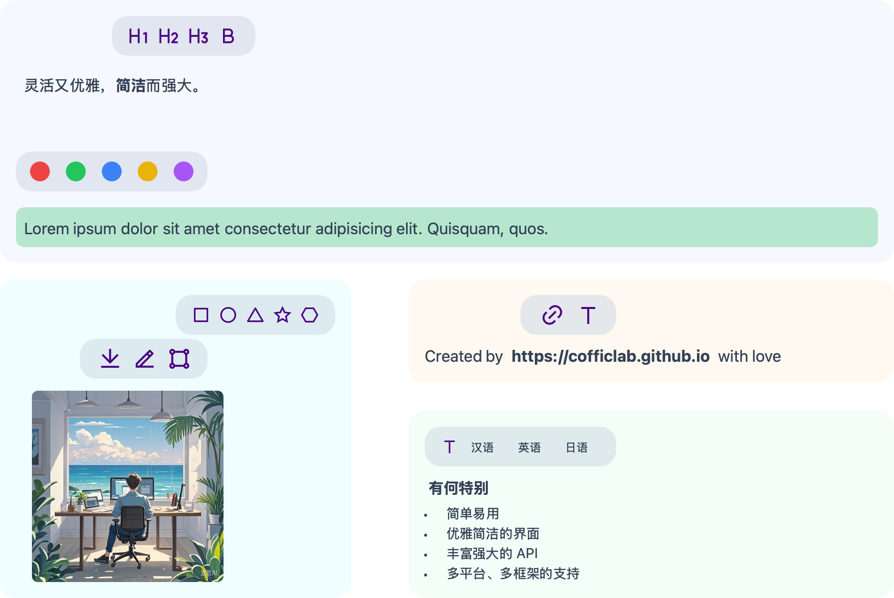

# JuiceEditor



A powerful rich text editor which name comes from a Chinese word "聚思" (gather your thoughts).

Currently still under development and not yet stable.

## Quick Start

### JavaScript/TypeScript

1. Install JuiceEditor

```bash
npm install @coffic/juice-editor
```

2. Use JuiceEditor in your project

```js
import { EditorFactory, Editor } from '@coffic/juice-editor'

const editor = EditorFactory.register('my-editor', {
    onBeforeCreate: () => {
        console.log('onBeforeCreate for label my-editor')
    },
    onCreate: (editor: Editor) => {
        console.log('onCreate for label my-editor')
        editor.enableLog()
    }
})

// When you type 'editor.', the IDE will suggest available APIs
```

3. Use in your template

```html
<my-editor></my-editor>
```

### Swift Package

1. Add the package to your project's dependencies:

```swift
dependencies: [
    .package(url: "https://github.com/CofficLab/JuiceEditor.git", from: "1.0.0")
]
```

2. Download WebApp:
   - Go to [Releases](https://github.com/CofficLab/JuiceEditor/releases)
   - Download `webapp.zip` for the version you're using
   - Extract it to `Sources/JuiceEditorKit/Resources/WebApp` in your project

3. Import and use in your code:

```swift
import JuiceEditorKit

// Use the editor in your SwiftUI view
struct ContentView: View {
    var body: some View {
        JuiceEditor()
    }
}
```

Note: Make sure the WebApp version matches your package version.

## Documentation

<https://cofficlab.github.io/en/juiceEditor/>

## Playground

<https://cofficlab.github.io/JuiceEditor-Playground/>

## Related Projects

- [JuiceEditor-Playground](https://github.com/cofficlab/JuiceEditor-Playground)
- [JuiceEditor-Examples](https://github.com/cofficlab/JuiceEditor-Examples)

## Products based on JuiceEditor

- [KuaiYiZhi APP](https://apps.apple.com/cn/app/%E5%BF%AB%E6%98%93%E7%9F%A5/id6457892799)
- [KuaiYiZhi](https://www.kuaiyizhi.cn)

## Built based on the following projects

- [Draw.io](https://github.com/jgraph/drawio)
- [TailwindCSS](https://tailwindcss.com/)
- [Vue3](https://v3.vuejs.org/)
- [Tiptap](https://tiptap.dev/)
- [Heroicons](https://heroicons.com)
- [RemixIcon](https://remixicon.com)

## NPM Packages

- [juice-editor](https://www.npmjs.com/package/@coffic/juice-editor)
- [juice-editor-draw](https://www.npmjs.com/package/@coffic/juice-editor-draw)

## Maintainer

Work for Joy & Live for Love ➡️ <https://github.com/nookery>

## Contributing

Show your ❤️ by ⭐️ing this repository! It means a lot.

Clone the repo, do something, make a PR.

Looking forward to your PRs, you amazing ideas.

## License

JuiceEditor is released under a dual license:

1. For non-commercial use: [MIT License](LICENSE)
2. For commercial use or modifications: Please [contact the author](https://github.com/nookery) for a commercial license.

Any use of this software for commercial purposes or any modifications to the source code require explicit permission from the author.
